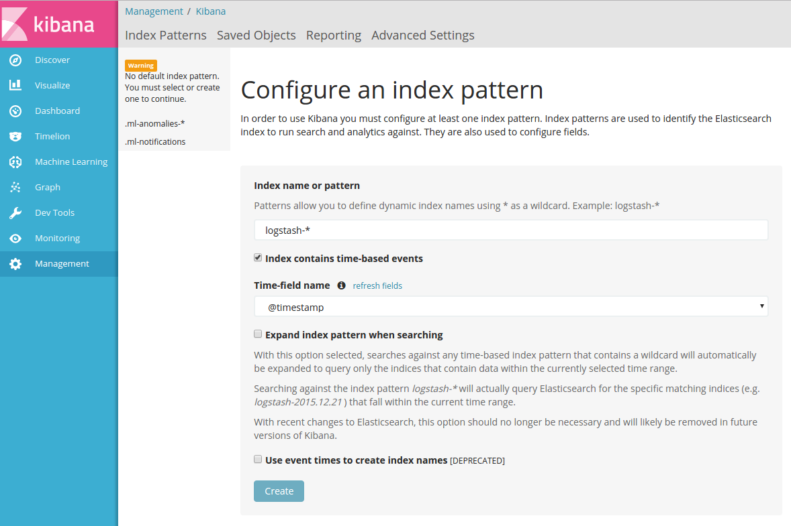
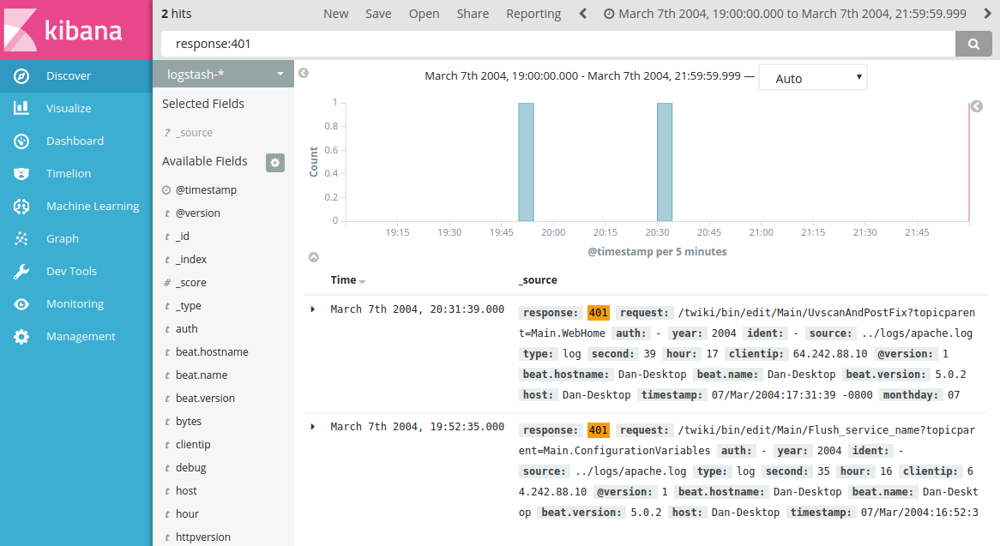
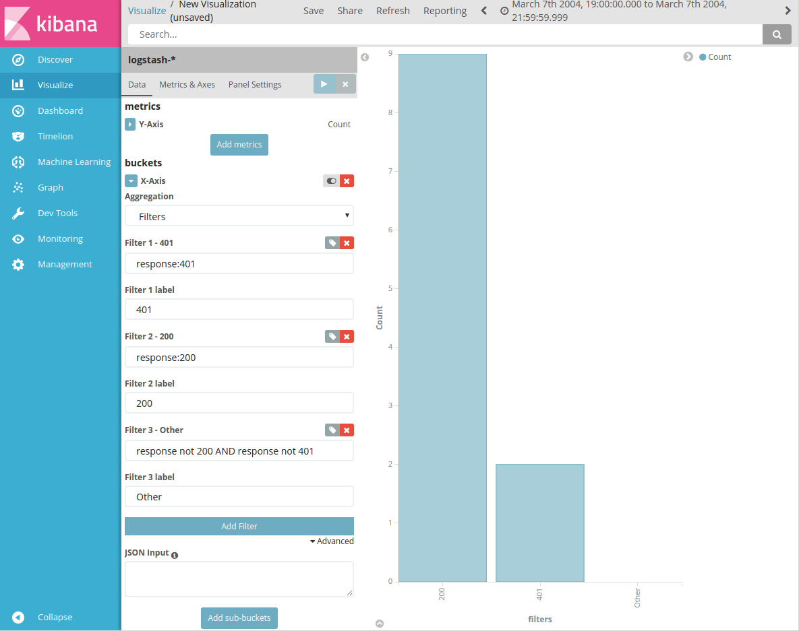

# Get Rolling With Logstash

This repository is meant to be a quick-start guide and skeleton for a Filebeat-Logstash-Elasticsearch-Kibana pipeline. It is partially based on [Elastic's logstash intro](https://www.elastic.co/guide/en/logstash/current/introduction.html) and uses docker for quick-and-easy startup.

## Components

Filebeat monitors one or more log files for new lines and forwards them to one or more destinations, such as Logstash. It keeps track of the last line read so that it doesn't send redundant messages.

Logstash can receive input from many sources for processing, filtering, and passing on to data storage, alerts and monitoring.

Elasticsearch is a flexible data store and provides multiple query routes.

# Setup

After checking out or downloading this repository, you will also need to [install Docker](https://docs.docker.com/engine/installation/).

If Docker fails to run without sudo, check the [post-installation steps](https://docs.docker.com/engine/installation/linux/linux-postinstall/) for Linux.

# Starting up the pipeline

## Starting Docker

Starting the Logstash, Elasticsearch, and Kibana containers is as simple as:

    docker-compose up

from the repository's base directory. Later, we may want to write Logstash's output to a file; the easiest way is:

    docker-compose up | tee logstash.log

Starting the containers for the first time may take a while as they need to be built from scratch.

## Starting Filebeat

The Filebeat container is described in a separate file, docker-compose-filebeat.yml, so that it can easily be started and stopped independent of the other containers. Start Filebeat by pointing `docker-compose` at that file:

    docker-compose -f docker-compose-filebeat.yml up

Filebeat keeps track of which lines from each log file it has already published. For purposes of this demo it is convenient to delete the registry file each time Filebeat is started:

    rm -f filebeat/data/registry ; docker-compose -f docker-compose-filebeat.yml up

Filebeat is also smart enough to hold onto events it wants to publish as long as the destination service is unreachable. This means we can start Filebeat and Docker in any order without losing data.

# Configuration

Here we will build up the configuration files for Filebeat and Logstash, looking at how each option contributes to the pipeline's functionality. The master branch of this repository contains the final versions of each config file, so it is ready to go out of the box.

## Configuring Filebeat

Filebeat uses `filebeat.yml` for configuration. A simple configuration for our setup looks like this:

    filebeat.prospectors:

    - input_type: log

      paths:
        - "/logs/cron.log"

    output.logstash:
      hosts: ["logstash-demo:5043"]

The block under `filebeat.prospectors:` tells Filebeat where to look for log files to monitor. `input_type: log` tells it to watch the end of each file for new lines and publish them. The other option for `input_type` is `stdin`, but `log` is the most common option.

The `output` block tells Filebeat how to publish events generated by its prospectors. The entry in `hosts` will point to our Logstash container when Docker is running.

## Configuring Logstash

Logstash uses `logstash.conf` for configuration. A basic Logstash configuration looks like this:

    input {
        beats {
            port => "5043"
        }
    }

    filter {

    }

    output {
        stdout { codec => rubydebug }
        elasticsearch {
            hosts => [ "elasticsearch-demo:9200" ]
        }
    }

`logstash.conf` has two required blocks, `input` and `output`, and one optional block, `filter`.

The `input` block tells Logstash how to listen for input. Here we're using the `beats` plugin to listen for input on port 5043, matching how we told Filebeat to publish its events. We're only running one Filebeat instance locally, but we could just as easily have many Filebeats running on different machines pointed at this one Logstash.

The `output` block tells Logstash where to send its output. We've set two output destinations, `stdout` and our Elasticsearch container. We use the `elasticsearch-demo:9200` because Docker containers don't communicate with each other via localhost. In this case, `elasticsearch-demo` is the Elasticsearch container_name specified in `docker-compose.yml`.

Finally, the optional `filter` block tells Logstash how to transform data it receives before sending it to the output. This is where all the processing takes place, and will be covered in the next section.

## Creating Logstash filters

Logstash supports a huge number of [filter plugins](https://www.elastic.co/guide/en/logstash/current/filter-plugins.html) for extracting useful data from events. We will be using grok, a basic regular-expression-based parser. The [grok debugger](https://grokdebug.herokuapp.com/) is a very useful tool for building grok filters and seeing the results without having to restart Logstash and Filebeat repeatedly.

We start by defining an empty grok filter:

    filter {
        grok {
            match => { "message" => ""}
        }
    }

The input we get from Filebeat comes in the `message` field, and we are applying a regular expression (currently empty) to it. Let's look at a typical line from cron.log and see what data we can get out of it:

    Mar 7 04:05:00 avas CROND[11233]: (cronjob) CMD (/usr/bin/mrtg /etc/mrtg/mrtg.cfg)

This line includes a timestamp, a process name (`CROND`), a pid, and a log message. Using the grok debugger, we can build the following regex to match this line:

    %{SYSLOGTIMESTAMP:timestamp} (?<hostname>\w+) (?<process_name>.+)\[(?<pid>\d+)\]: \((?<username>\w+)\) CMD (?<command>[\S ]+)

There's a lot going on here, so let's look at parts of it individually. One way for grok to get data from a message into a field is using "named captures", as above in `(?<hostname>\w+)`. This part of the regex takes everything that matches the regular expression `\w+` and puts it into the `hostname` field.

grok also pre-defines a large number of patterns for us, which can be included as `%{SYSLOGTIMESTAMP}`. That particular pattern matches the timestamp `Mar 7 04:05:00` in our log line. We tell grok to put the matching timestamp string in the field `timestamp` by using `%{SYSLOGTIMESTAMP:timestamp}`. This is how we can put parsed data into fields using pre-defined patterns.

Let's add this pattern to our grok filter and see what happens:

    filter {
        grok {
            match => {
                "message" =>
                "%{SYSLOGTIMESTAMP:timestamp} (?<hostname>\w+) (?<process_name>.+)\[(?<pid>\d+)\]: \((?<username>\w+)\) CMD (?<command>[\S ]+)"
            }
        }
    }

With only the first line in cron.log, logstash's output looks like this:

    logstash-demo    | {
    logstash-demo    |           "offset" => 84,
    logstash-demo    |       "input_type" => "log",
    logstash-demo    |              "pid" => "11233",
    logstash-demo    |           "source" => "/logs/cron.log",
    logstash-demo    |          "message" => "Mar 7 04:05:00 avas CROND[11233]: (cronjob) CMD (/usr/bin/mrtg /etc/mrtg/mrtg.cfg) ",
    logstash-demo    |             "type" => "log",
    logstash-demo    |          "command" => "/usr/bin/mrtg /etc/mrtg/mrtg.cfg",
    logstash-demo    |             "tags" => [
    logstash-demo    |         [0] "beats_input_codec_plain_applied"
    logstash-demo    |     ],
    logstash-demo    |         "hostname" => "avas",
    logstash-demo    |       "@timestamp" => 2016-12-01T21:46:58.370Z,
    logstash-demo    |     "process_name" => "CROND",
    logstash-demo    |         "@version" => "1",
    logstash-demo    |             "beat" => {
    logstash-demo    |         "hostname" => "Dan-Desktop",
    logstash-demo    |             "name" => "Dan-Desktop",
    logstash-demo    |          "version" => "5.0.2"
    logstash-demo    |     },
    logstash-demo    |             "host" => "Dan-Desktop",
    logstash-demo    |        "timestamp" => "Mar 7 04:05:00",
    logstash-demo    |         "username" => "cronjob"
    logstash-demo    | }

This shows the results of parsing that log line using our filter. There are some internal fields from Logstash and Filebeat, but the fields we defined in the pattern are there too! These are all the fields that will get sent up to Elasticsearch with our event. We will look at querying what's in Elasticsearch in a later section.

This is pretty good, but take a look at the `timestamp` field. It's human-readable, but not that useful as a plain string. Let's add another grok filter to parse out the individual fields:

    filter {
        grok {
            match => {
                "message" =>
                "%{SYSLOGTIMESTAMP:timestamp} (?<hostname>\w+) (?<process_name>.+)\[(?<pid>\d+)\]: \((?<username>\w+)\) CMD \((?<command>[\S ]+)\)"
            }
        }

        # Parse timestamp
        grok {
            match => { "timestamp" => "%{MONTH:month} +%{MONTHDAY:monthday} (?!<[0-9])%{HOUR:hour}:%{MINUTE:minute}(?::%{SECOND:second})(?![0-9])" }
        }
    }

In the new filter, we're looking at the `timestamp` field defined in the previous filter, and applying another regex to it. This regex is built up from the `SYSLOGTIMESTAMP` pattern defined in [grok's base pattern file](https://github.com/logstash-plugins/logstash-patterns-core/blob/master/patterns/grok-patterns), with field names added to the sub-patterns as defined before.

When we run everything again with this new filter in place, we get:

    logstash-demo    | {
    logstash-demo    |         "monthday" => "7",
    logstash-demo    |           "offset" => 84,
    logstash-demo    |       "input_type" => "log",
    logstash-demo    |              "pid" => "11233",
    logstash-demo    |           "source" => "/logs/cron.log",
    logstash-demo    |          "message" => "Mar 7 04:05:00 avas CROND[11233]: (cronjob) CMD (/usr/bin/mrtg /etc/mrtg/mrtg.cfg) ",
    logstash-demo    |             "type" => "log",
    logstash-demo    |          "command" => "/usr/bin/mrtg /etc/mrtg/mrtg.cfg",
    logstash-demo    |             "tags" => [
    logstash-demo    |         [0] "beats_input_codec_plain_applied"
    logstash-demo    |     ],
    logstash-demo    |           "minute" => "05",
    logstash-demo    |           "second" => "00",
    logstash-demo    |         "hostname" => "avas",
    logstash-demo    |       "@timestamp" => 2016-12-01T21:42:54.549Z,
    logstash-demo    |            "month" => "Mar",
    logstash-demo    |             "hour" => "04",
    logstash-demo    |     "process_name" => "CROND",
    logstash-demo    |         "@version" => "1",
    logstash-demo    |             "beat" => {
    logstash-demo    |         "hostname" => "Dan-Desktop",
    logstash-demo    |             "name" => "Dan-Desktop",
    logstash-demo    |          "version" => "5.0.2"
    logstash-demo    |     },
    logstash-demo    |             "host" => "Dan-Desktop",
    logstash-demo    |        "timestamp" => "Mar 7 04:05:00",
    logstash-demo    |         "username" => "cronjob"
    logstash-demo    | }

Now we have some new fields, `month`, `monthday`, `hour`, `minute`, and `second`, added to our event data. These will be useful if we want to search for events by time.

## Excluding messages

Let's put the rest of the lines back in cron.log and see if our filters work for all of them. Restarting everything again, we get the following for the last line:

    logstash-demo    | {
    logstash-demo    |     "@timestamp" => 2016-12-01T21:55:19.168Z,
    logstash-demo    |         "offset" => 1228,
    logstash-demo    |       "@version" => "1",
    logstash-demo    |     "input_type" => "log",
    logstash-demo    |           "beat" => {
    logstash-demo    |         "hostname" => "Dan-Desktop",
    logstash-demo    |             "name" => "Dan-Desktop",
    logstash-demo    |          "version" => "5.0.2"
    logstash-demo    |     },
    logstash-demo    |           "host" => "Dan-Desktop",
    logstash-demo    |         "source" => "/logs/cron.log",
    logstash-demo    |        "message" => "Mar 7 04:22:00 avas anacron[11464]: Updated timestamp for job `cron.weekly' to 2004-03-07",
    logstash-demo    |           "type" => "log",
    logstash-demo    |           "tags" => [
    logstash-demo    |         [0] "beats_input_codec_plain_applied",
    logstash-demo    |         [1] "_grokparsefailure"
    logstash-demo    |     ]
    logstash-demo    | }

The tag `_grokparsefailure` indicates that one of our filters failed on the line `Mar 7 04:22:00 avas anacron[11464]: Updated timestamp for job 'cron.weekly' to 2004-03-07`. Indeed it doesn't match our pattern, but we're not actually interested in storing this message anyway. We can tell Filebeat or Logstash to ignore lines like this.

In `filebeat.yml`, we can tell the prospector to ignore lines using the `exclude_lines` rule:

    filebeat.prospectors:
    - input_type: log

        paths:
          - "/logs/cron.log"

        exclude_lines: ["Updated timestamp for job"]

This rule takes one or more regular expressoins, and excludes any line that matches one of them.

In Logstash, the `drop{}` command discards the current message and moves on to the next. For this simple case we can add the following rule at the top of the filter block:

    filter {
        if ([message] =~ /Updated timestamp for job/) {
            drop{}
        }
        ...

Re-running everything with either of these rules in place, we see that the `_grokparsefailure` no longer appears.

Using Filebeat or Logstash is equivalent in this example, but it's a potentially important decision in a production environment. Excluding lines with Filebeat decreases network traffic, but increases the amount of processing Filebeat must do, potentially impacting the performance of its host machine. Dropping messages in Logstash allows for more logic, but the messages must first get to the Logstash server.

## Processing two different files

Let's add another prospector to Filebeat's configuration to read a new file and see what happens:

    filebeat.prospectors:
    - input_type: log

        paths:
          - "/logs/cron.log"

        exclude_lines: ["Updated timestamp for job"]

    - input_type: log
        paths:
          - "/logs/apache.log"

Oh no! We get a lot of new `_grokparsefailure` messages. Let's look at a line from apache.log to find out why.

    64.242.88.10 - - [07/Mar/2004:16:47:12 -0800] "GET /robots.txt HTTP/1.1" 200 68

This looks pretty different from the line from cron.log, causing the grok filter to fail. We need to write a new filter, but this line is kind of complicated. Luckily grok has a pre-defined pattern for Apache logs:

    %{COMMONAPACHELOG}

Since we want to run one filter or the other on each incoming message, we add the new filter to grok like this:

    grok {
        match => {
            "message" => [
                # cron
                "%{SYSLOGTIMESTAMP:timestamp} (?<hostname>\w+) (?<process_name>.+)\[(?<pid>\d+)\]: \((?<username>\w+)\) CMD \((?<command>[\S ]+)\)",
                # apache
                "%{COMMONAPACHELOG}"
                ]
        }
    }

Note that the value for "message" is now an array instead of a string. With this new filter we now get output from apache.log that includes some new fields:

    logstash-demo    | {
    logstash-demo    |         "request" => "/robots.txt",
    logstash-demo    |          "offset" => 80,
    logstash-demo    |            "auth" => "-",
    logstash-demo    |           "ident" => "-",
    logstash-demo    |      "input_type" => "log",
    logstash-demo    |            "verb" => "GET",
    logstash-demo    |          "source" => "/logs/apache.log",
    logstash-demo    |         "message" => "64.242.88.10 - - [07/Mar/2004:16:47:12 -0800] \"GET /robots.txt HTTP/1.1\" 200 68",
    logstash-demo    |            "type" => "log",
    logstash-demo    |            "tags" => [
    logstash-demo    |         [0] "beats_input_codec_plain_applied",
    logstash-demo    |         [1] "_grokparsefailure"
    logstash-demo    |     ],
    logstash-demo    |      "@timestamp" => 2016-12-01T22:11:50.479Z,
    logstash-demo    |        "response" => "200",
    logstash-demo    |           "bytes" => "68",
    logstash-demo    |        "clientip" => "64.242.88.10",
    logstash-demo    |        "@version" => "1",
    logstash-demo    |            "beat" => {
    logstash-demo    |         "hostname" => "Dan-Desktop",
    logstash-demo    |             "name" => "Dan-Desktop",
    logstash-demo    |          "version" => "5.0.2"
    logstash-demo    |     },
    logstash-demo    |            "host" => "Dan-Desktop",
    logstash-demo    |     "httpversion" => "1.1",
    logstash-demo    |       "timestamp" => "07/Mar/2004:16:47:12 -0800"
    logstash-demo    | }

Why are we still getting a `_grokparsefailure`? The `%{COMMONAPACHELOG}` filter is also creating a field called `timestamp`, and it's going through our timestamp filter, but it's in a different format! Let's add a new timestamp filter as well:

    # Parse timestamp
    grok {
        match => {
            "timestamp" => [
                # cron
                "%{MONTH:month} +%{MONTHDAY:monthday} (?!<[0-9])%{HOUR:hour}:%{MINUTE:minute}(?::%{SECOND:second})(?![0-9])"
                # apache
                "%{MONTHDAY:monthday}/%{MONTH:month}/%{YEAR:year}:(?!<[0-9])%{HOUR:hour}:%{MINUTE:minute}(?::%{SECOND:second})(?![0-9]) %{INT:int}"
            ]
        }
    }

Now when we use the new timestamp filter:

    logstash-demo    | {
    logstash-demo    |         "request" => "/mailman/listinfo/administration",
    logstash-demo    |            "auth" => "-",
    logstash-demo    |            "year" => "2004",
    logstash-demo    |           "ident" => "-",
    logstash-demo    |          "source" => "/logs/apache.log",
    logstash-demo    |            "type" => "log",
    logstash-demo    |          "second" => "54",
    logstash-demo    |            "hour" => "16",
    logstash-demo    |        "clientip" => "64.242.88.10",
    logstash-demo    |        "@version" => "1",
    logstash-demo    |            "beat" => {
    logstash-demo    |         "hostname" => "Dan-Desktop",
    logstash-demo    |             "name" => "Dan-Desktop",
    logstash-demo    |          "version" => "5.0.2"
    logstash-demo    |     },
    logstash-demo    |            "host" => "Dan-Desktop",
    logstash-demo    |       "timestamp" => "07/Mar/2004:16:58:54 -0800",
    logstash-demo    |        "monthday" => "07",
    logstash-demo    |          "offset" => 1009,
    logstash-demo    |      "input_type" => "log",
    logstash-demo    |            "verb" => "GET",
    logstash-demo    |         "message" => "64.242.88.10 - - [07/Mar/2004:16:58:54 -0800] \"GET /mailman/listinfo/administration HTTP/1.1\" 200 6459",
    logstash-demo    |             "int" => "-0800",
    logstash-demo    |            "tags" => [
    logstash-demo    |         [0] "beats_input_codec_plain_applied"
    logstash-demo    |     ],
    logstash-demo    |          "minute" => "58",
    logstash-demo    |      "@timestamp" => 2016-12-01T22:05:31.857Z,
    logstash-demo    |           "month" => "Mar",
    logstash-demo    |        "response" => "200",
    logstash-demo    |           "bytes" => "6459",
    logstash-demo    |     "httpversion" => "1.1"
    logstash-demo    | }

Now that we are prospecting on two different files, it might be a good idea to add a field to Filebeat's output to Logstash that lets us tell the source of each event. Filebeat supports adding arbirtary fields using the `fields` parameter:

    - input_type: log

      paths:
        - "/logs/cron.log"

      exclude_lines: ["Updated timestamp for job"]

      fields:
        service: cron

      fields_under_root: true

    - input_type: log

      paths:
        - "/logs/apache.log"

      fields:
        service: apache

      fields_under_root: true

In this case we have added the `service` field to both prospectors, with the value `cron` or `apache` corresponding to the service the logs came from. The `fields_under_root` parameter causes the fields to be added at the top level of the event instead of as children of a `fields` object, which is the default behavior. Now our logstash event has our new `service` field:

    logstash-demo    | {
    logstash-demo    |         "request" => "/mailman/listinfo/administration",
    ...
    logstash-demo    |          "minute" => "58",
    logstash-demo    |      "@timestamp" => 2016-12-01T22:05:31.857Z,
    logstash-demo    |           "month" => "Mar",
    logstash-demo    |         "service" => "apache",
    logstash-demo    |        "response" => "200",
    logstash-demo    |           "bytes" => "6459",
    logstash-demo    |     "httpversion" => "1.1"
    logstash-demo    | }

## Updating `@timestamp`

You might have noticed that along with the `timestamp` field we've been looking at, there's also a field called `@timestamp`. This field is added by Filebeat, and is the time that the event was published. If you're loading logs live on a server this is pretty close to the time they were generated, but in this case our test data were generated in 2004. This is not a big deal, except that Kibana looks at `@timestamp` by default for the event time, so when we load these events into Kibana it will look like they all happened at once.

We can fix this by writing an additional filter in Logstash to convert the given `timestamp` field to the ISO 8601 format that Kibana uses and assign it to the `@timestamp` field. Logstash provides a special filter for just this purpose, called `date`. Let's add this to the end of our `filter` block:

    # Update @timestamp
    date {
        locale => "en"
        match => [
            "timestamp",
            # cron
            "MMM d HH:mm:ss",
            # apache
            "dd/MMM/yyyy:HH:mm:ss Z"
        ]
        timezone => "Etc/UTC"
        target => "@timestamp"
        add_field => { "debug" => "timestampMatched"}
    }

The `match` parameter is where most of the action is happening. The first parameter tells the date parser which field to look at; in this case, the `timestamp` field we built earlier. The others are date formats to attempt to match against the given field. (See [Elastic's documentation](https://www.elastic.co/guide/en/logstash/current/plugins-filters-date.html#plugins-filters-date-match) for details on the time format strings.)

If a timestamp matches one of the format strings, it is converted to the ISO8601 format that Kibana expects, and loaded into the field specified by the `target` parameter. `@timestamp` is actually the default value for `target`, but it is nice to have it there for clarity.

As for the other parameters we've included: `locale` specifies the language for reading the names of months and days of the week; `timezone` specifies the target timezone to convert the timestamp to; and `add_field` adds a field to the output, in this case with the name `debug` and value `timestampMatched`, but only if the filter successfully matches.

Let's rerun everything and see what we get now:

    logstash-demo    | {
    logstash-demo    |         "monthday" => "7",
    logstash-demo    |            "debug" => "timestampMatched",
    logstash-demo    |           "offset" => 1138,
    logstash-demo    |       "input_type" => "log",
    logstash-demo    |              "pid" => "11460",
    logstash-demo    |           "source" => "/logs/cron.log",
    logstash-demo    |          "message" => "Mar 7 04:22:00 avas CROND[11460]: (cronjob) CMD (run-parts /etc/cron.weekly) ",
    logstash-demo    |             "type" => "log",
    logstash-demo    |          "command" => "run-parts /etc/cron.weekly",
    logstash-demo    |             "tags" => [
    logstash-demo    |         [0] "beats_input_codec_plain_applied"
    logstash-demo    |     ],
    logstash-demo    |           "minute" => "22",
    logstash-demo    |           "second" => "00",
    logstash-demo    |         "hostname" => "avas",
    logstash-demo    |       "@timestamp" => 2017-03-07T04:22:00.000Z,
    logstash-demo    |            "month" => "Mar",
    logstash-demo    |             "hour" => "04",
    logstash-demo    |          "service" => "cron",
    logstash-demo    |     "process_name" => "CROND",
    logstash-demo    |         "@version" => "1",
    logstash-demo    |             "beat" => {
    logstash-demo    |         "hostname" => "Dan-Desktop",
    logstash-demo    |             "name" => "Dan-Desktop",
    logstash-demo    |          "version" => "5.0.2"
    logstash-demo    |     },
    logstash-demo    |             "host" => "Dan-Desktop",
    logstash-demo    |        "timestamp" => "Mar 7 04:22:00",
    logstash-demo    |         "username" => "cronjob"
    logstash-demo    | }

For this message, the @timestamp field now has `2017-03-07T04:22:00.000Z` instead of the current time. This matches the timestamp `Mar 7 04:22:00` from the log message, except that the message didn't specify a year so it's defaulted to the current one. This will save us some trouble when we start visualizing our data in Kibana.

## Querying Elasticsearch

We now have a robust pipeline, but where does it go? Let's query Elasticsearch and confirm that our data are getting there.

Elasticsearch supports multiple query formats, but let's stick with cURL:

    curl -XGET 'localhost:9200/_all/_search?pretty&q=response:401&size=5'

This command queries for all entries with a `response` field equal to "401". It returns:

    {
      "took" : 19,
      "timed_out" : false,
      "_shards" : {
        "total" : 15,
        "successful" : 15,
        "failed" : 0
      },
      "hits" : {
        "total" : 13,
        "max_score" : 4.245193,
        "hits" : [ {
          "_index" : "logstash-2016.12.01",
          "_type" : "log",
          "_id" : "AVi7sy8RTKCtP44a6uQR",
          "_score" : 4.245193,
          "_source" : {
              "request" : "/twiki/bin/edit/Main/Flush_service_name?topicparent=Main.ConfigurationVariables",
              "auth" : "-",
              "year" : "2004",
              "ident" : "-",
              "source" : "/logs/apache.log",
              "type" : "log",
              "second" : "35",
              "hour" : "16",
              "clientip" : "64.242.88.10",
              "@version" : "1",
              "beat" : {
                "hostname" : "Dan-Desktop",
                "name" : "Dan-Desktop",
                "version" : "5.0.2"
              },
              "host" : "Dan-Desktop",
              "timestamp" : "07/Mar/2004:16:52:35 -0800",
              "monthday" : "07",
              "debug" : "timestampMatched",
              "offset" : 580,
              "input_type" : "log",
              "verb" : "GET",
              "message" : "64.242.88.10 - - [07/Mar/2004:16:52:35 -0800] \"GET /twiki/bin/edit/Main/Flush_service_name?topicparent=Main.ConfigurationVariables HTTP/1.1\" 401 12851",
              "int" : "-0800",
              "tags" : [
                "beats_input_codec_plain_applied"
              ],
              "minute" : "52",
              "@timestamp" : "2004-03-08T00:52:35.000Z",
              "month" : "Mar",
              "service" : "apache",
              "response" : "401",
              "bytes" : "12851",
              "httpversion" : "1.1"
          }
        }, {
        .
        .
        .
        } ]
      }
    }

This confirms that we got our logs from apache.log into Elasticsearch! It shows `"total" : 13` hits, but only 5 returned because we specified `size=5` in our query. If the total of 13 seems high, it's because we have some duplicates in the Elasticsearch index due to clearing and restarting Filebeat. We can clear out the Elasticsearch index entirely with:

    curl -XDELETE 'http://localhost:9200/_all'

Now if we re-run Filebeat and run the same query again we get 2 hits, which matches the number of 401s in apache.log.

## Exploring with Kibana

Now we're ready to see our data in Kibana!

Go to `http://localhost:5601` in a browser and you'll see the "Configure an index pattern" screen. This is used to tell Kibana how to read an Elasticsearch index. The index pattern `logstash-*` is selected be default, and this is what we want. Make sure "Index contains time-based events" is checked, and `@timestamp` is selected for the "Time-field name" and click "Create".

Now Kibana is set up to read our Elasticsearch index, so let's see what's in it! Click "Discover" to start a new query. This screen will probably not show anything at first, as the default time range is "Last 15 minutes". Click that range (in the upper-right corner) and set the range to `2004-03-07 19:00:00` to `2004-03-07 21:59:59.999`. This will get all the results from the Apache log, and should return a total of 11 results.

Let's repeat our earlier query for entries with a `response` field equal to "401". Enter `response:401` in the search field and hit enter. You should get something like this:

Here we see the same two results as before, but with a nice frequency bar graph.

Lastly, Kibana also has a powerful visualization builder. Without getting into the details, it is possible to use our Elasticsearch data to build all kinds of graphs and charts. Below is a histogram of Apache logs, grouped by response code:

You can recreate this visualization in your local Kibana instance with [this link](http://localhost:5601/goto/bdcdedfe83862f9aae6e27b95943d5ed).

# Credits

Filebeat, Logstash, and Elasticsearch were created by [Elastic](https://www.elastic.co/). Docker was created by [Docker Inc](https://www.docker.com/). Sample logs taken from http://www.monitorware.com/en/logsamples/. All other work is by me.
